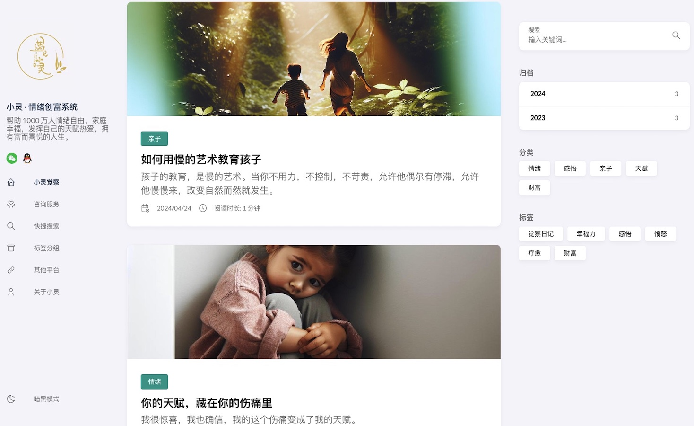
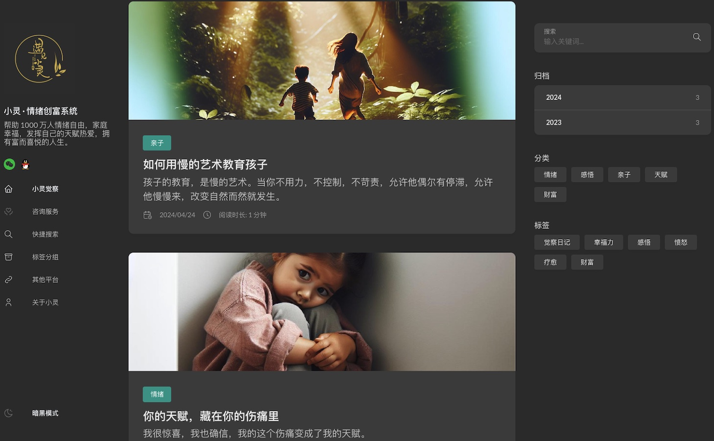
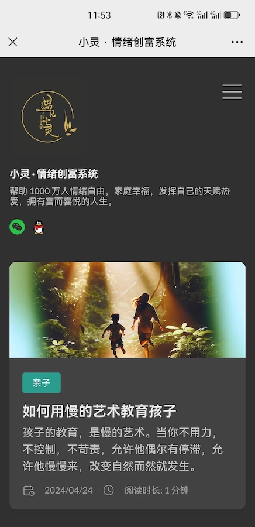
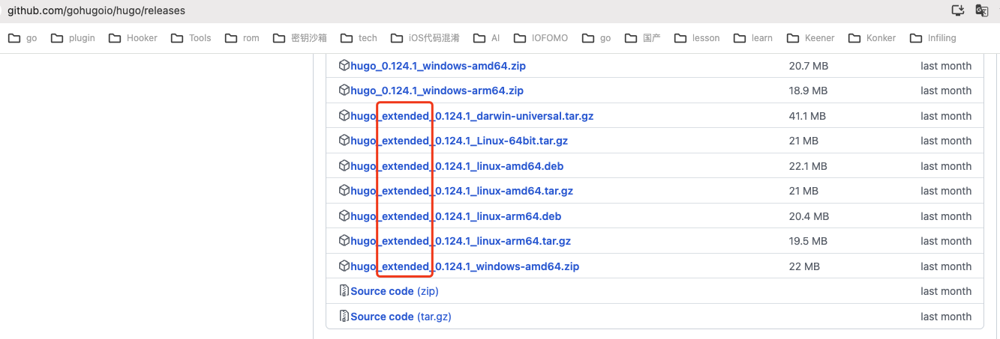

<p align="center">
  <a href="#">
    
  </a>
</p>

<p align="center">
    
</p>


## Instruction

This website is built using `hugo` theme with `Stack`, a faster static website generator.

This is a gift for my lover who is a knowledge sharing blog to build a nest for her on the Internet.

It is because of the following open-source project that we have our own website.

-   [hugo](https://gohugo.io/)
-   [stack](https://stack.jimmycai.com/)

Welcome to our official website [yujianxiaoling.com](https://yujianxiaoling.com) .

For more information, please refer to blog articles [Infiling](https://iofomo.com/infiling) .

## Talk is cheap, show me the product

|     功能     | 桌面端              | 移动端                  |
| :----------: | ------------------- | ----------------------- |
| 主页明亮模式 |  |  |
| 主页暗黑模式 |  |   |

## Build

Download `hugo` with `v0.124.1` `extend`



```shell
# for develop
$ ./run.sh

# for release
$ ./build.sh
```

## Thanks


## LICENSE

This project is licensed under the terms of the `MIT` license. See the [LICENSE](LICENSE) file.

>   This project and all tools are open source under the MIT license, which means you have full access to the source code and can modify it to fit your own needs. 
