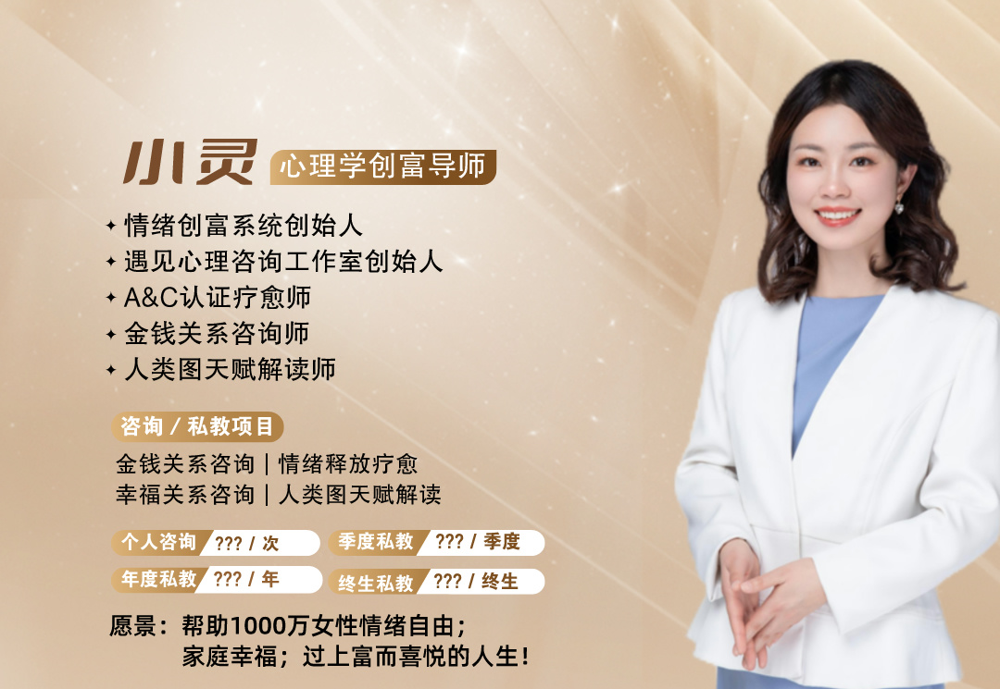
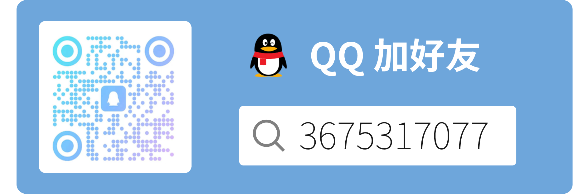

### 遇见

我是一位 85 后 宝妈，从小就一直被负面情绪缠身，越成长却越困扰；在经过多年的深度学习和自我实践，现在的我是一名情绪自由、家庭幸福的心理学创富导师。

经历过黑暗，也想为你照亮。

我善于觉察细腻的情绪变化，擅长帮助他人轻松摆脱情绪的困扰，在过程中被治愈，从而提升内在力，改善关系品质，实现内外富足的人生。

### 联系

#### 微信

**小灵的微信：**

>扫码添加 小灵 个人微信，成为微信好友，直接一对一咨询哦

**小灵的公众号：**

>扫描关注 小灵情绪创富系统 公众号，在这里我会分享对学习和生活的感悟，用心理学和营销，助力你情绪自由，家庭幸福，过上富而喜悦的人生。

#### 邮箱

>如果你在意个人隐私，你也可以通过发邮件的方式和我联系，我通常会在 24 小时内给你回复。

地址：infiling@foxmail.com

#### QQ

>你也可以通过 **QQ**（遇见小灵）和我互动。

QQ号：3675317077 

扫二维码：

