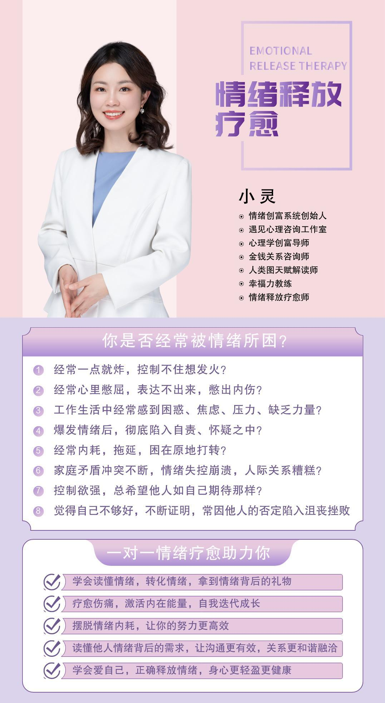
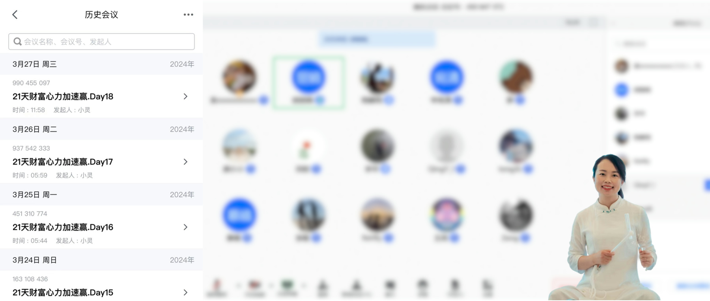
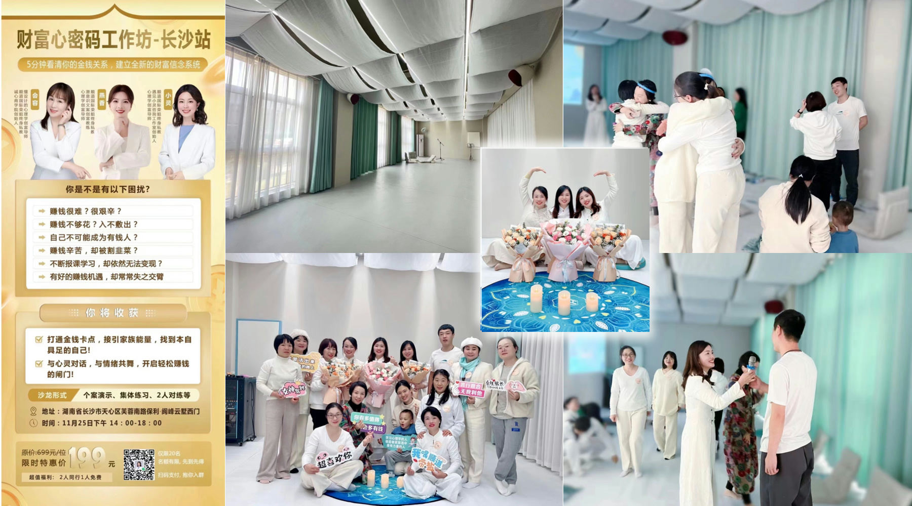
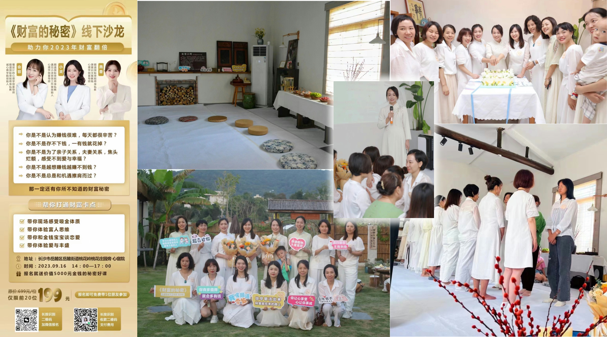

以下服务你都可以通过 [**☞ 点击这里 ☜**](/about/#联系)  关注我们的微信公众号预约咨询。

### 情绪疗愈

### 金钱关系

### 人类图天赋

### 每日实修

通过每天对身体的冥想、瑜伽、呼吸练习，提升能量，可以帮你：

-   **增强情绪稳定性**：通过实修，人们可以学会更好地管理情绪波动，减少情绪波动带来的负面影响。

-   **减轻压力**：通过冥想、瑜伽和其他放松技巧，可以帮助减轻压力和焦虑，提高情绪管理能力，从而促进心理健康。
-   **增强专注力**：定期的实修可以帮助提高注意力和集中力，使人在工作和学习中更加专注和高效。
-   **改善睡眠质量**：身体活动和放松练习可以调节身体的生物钟，有助于改善睡眠质量，使人更有精力和活力。
-   **提升自我意识**：通过内观和自我反思，实修可以帮助人们更好地了解自己的思想和情感，提高自我意识。
-   **提高生活质量**：通过提高身体健康和心理健康，实修可以提高个人的生活质量，使人感到更加幸福和满足。
-   **培养习惯和自律**：每日实修需要一定的纪律和承诺，这有助于培养良好的习惯和自律能力。
-   **增强社交联系**：参加团体实修活动，如瑜伽课或运动小组，可以增加社交互动，建立新的友谊和支持网络。
-   **精神成长**：对于追求精神成长的人来说，每日实修是连接内在自我、探索生命意义和实现个人潜能的重要途径。
-   **提高创造力**：某些实修活动，如冥想和艺术创作，可以激发创造力和灵感。

### 线下沙龙

制约着我们情绪和财富的因素，有外在的阻碍，也有内在的；有你能看得见的，也有无形层面你看不见的；线下沙龙可以现化内在的看不见的心理思维，将内心深处的阻碍展现出来，直达心底，解决你的根源问题。

**有人说：**一到这个场域，身心都喜欢，很包容，很舒服，好久没有这样放松了…

**有人说：**卡滞了多年的童年阴影被疗愈了，轻松了，释怀了…

**有人说：**原来财富还有这么多隐形的制约，是我们不知道的，刷新了认知…

有人在这个场域里放声痛哭，释放了挤压多年的负面情绪后，收获力量，又大声欢笑…

生活中也许你从未敢向人展示的脆弱和压抑，在这里得到了接纳和转化。

