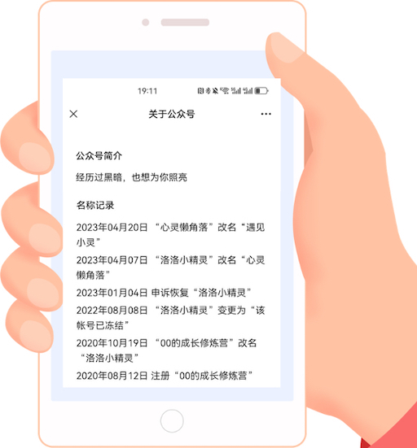
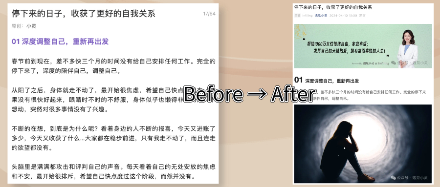
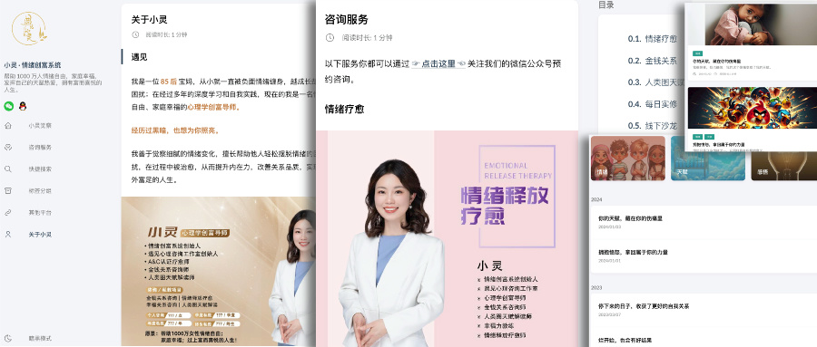

### 激情的开始，然却崩了

我从`2020`年就开通了公众号，甚至花了很长的时间想了第一个名字（为啥是第一个😓）：00的成长修炼营，然后迅速报了个公众号的课程，学习了一些排版的方法，关注了观摩一批顶流大号，好像一切都准备好了，但却是不知道写什么，拖着拖着后来不了了之了。

现在回想起来，当时最大的问题其实是并不知道写作的目的是什么，不知道真正做这件事的意义是什么。

结果可想而知，后来由于长时间没有更新，公众号竟然被冻结了😭。虽然内容没更新多少，名字倒是被我来回折腾好几回😆。

现在的名字是：“小灵情绪创富系统” 😂。

### 再次重启，又停摆了

来到`2023`年，在进化姐的推动下，再次开通了公众号。加入了“007不写就出局”，一周需要写一篇文章。这次的目的很简单，就是坚持写下去，不管写的多烂先坚持一年。锻炼自己输出的能力，先养成写的习惯。没有记录就没有发生，这些年学了很多课程，一直在输入，没有输出。

一直逃避输出，其实是不接受流水账，不接纳不完美的自己。

然而要完成第一篇文章了，依然是有些迷茫和焦虑的，不知道写什么好。

先生说：“成长肯定是不舒服的，你开始了就很好，不用纠结写的好不好，开始时是个菜鸟很正常，一开始就想写成高手才不切实际。你现在关注那些顶流的大号，那是他们现在的样子，你若是看他们早些年刚开始无人问津的样子，和现在的你水平一样，甚至更差，只是他们坚持下来，坚持做下去才会变得越来越专业”。

突然就释怀了，接纳自己这个阶段就是个菜鸟。

那时候阳了，生病后状态就一直不太好，懒懒的不想动，很多事情心有余而力不足。突然对很多事情失去了兴趣，也不想看书，不想学习，不想发朋友圈，甚至也不想娱乐......也不想写这篇文章。每次都是几天前就开始写，一直拖延，拖到了最后一天。

拖到最后一天压力就很大了，思绪很混乱的时候没有任何灵感和头绪，硬着头皮凑数字。想到这次的目的是要坚持写下去，所以不管多烂的开始都没关系，写下来，记录这个艰难的开始。

年末的时候内心让我知道我需要停下来，静下来，把注意力从外界各种各样的事情中收回来，放到自己的身上，关照自己的内心和身体了。

有天一个人在小房间静坐了很久，体会到密护根门的重要性。很久没有好好地，不慌不忙的看一本书，写一点字，好好地和自己在一起了。

进入知识付费这个圈子后，好像忘记了最重要的东西，一直在学习，一直在关注谁有多厉害，谁又赚了多少钱，谁比较讨人喜欢，谁又有什么成绩......这个过程中反复的出现焦虑，有匮乏，有挣扎，忘了活在当下。

接下来的这段时间，好好地回归内在，好好地梳理下自己，好好地做断舍离，好好地静心和看书，记录每次灵感碎片，写下每日觉察日记，回归简单。

### 收拾残局，继续再来

时间来到了一年后的`2024`上旬，虽然没有坚持定期更新，但在这段时间里：

-   写下了上千篇觉察日记；
-   第一次出镜线上直播；
-   第一次主办线下沙龙；
-   拥有了自己的工作室；
-   带领了团队实修；
-   开启了私教陪伴......

先生问我，“现在的你已经准备好输出了吗”，我说：“可以，但是需要你的帮助”。于是我开始从记录的素材里整理原始文章；先生让我保护好自己的精力在觉察和思考上，他来帮我全平台运营和发布。

于是我重新确定了名字，把之前的文章统一了风格，确定了简约的布局格式，去除了不合适内容，让大家获得最佳的阅读体验。

先生还为我搭建了专属的互联网小窝，遇见小灵官网（yujianxiaoling.com），这里收录了我最全的输出内容哦。

破壳总是带着痛伴随着苦的，每一次都有点难，但是每次都比以前更好，虽然还远不够好，但却值得我继续坚持下去；烂开始，依然会有好结果，希望你们也可以。
