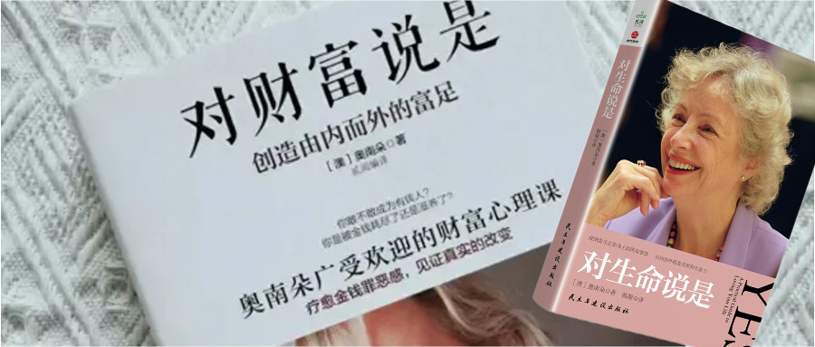
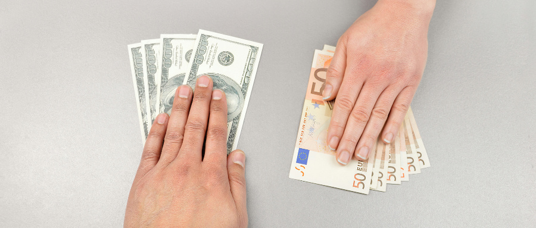
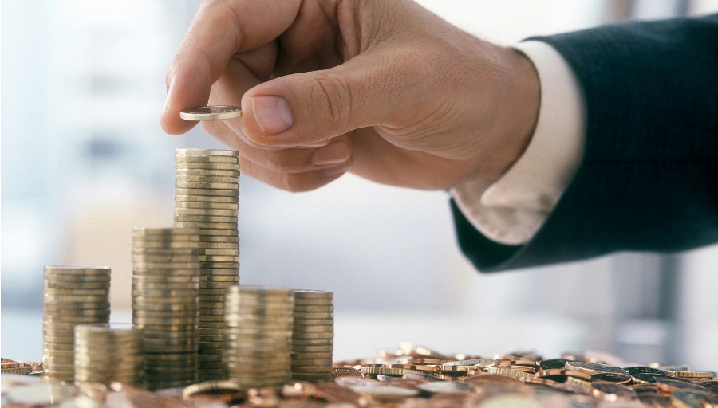

### 对待金钱和财富的态度

**奥兰朵**是全世界知名的身心灵和财富导师，著有《对财富说是》，《对生命说是》等畅销书，被誉为心灵成长的领航员，具有全球影响力和启发性的成功女性。

她说，我们对待金钱和财富的态度就是我们对待生命的态度。和拥有多少没有直接的关系。

最快乐的人往往不是拥有财富最多的人，而是最懂得享受和感恩的人。

外在世界是内在世界的显化，你生命中呈现的一切状态都是内心的显化。内在有多富足，内心就有多丰盛。内在价值感提升，外在价值感随之上扬。

我们与金钱的关系与原生家庭的关系有着很大的关系，与童年的经历和形成的信念有很大的关系，与我们执着的神经反应的固有模式有很大的关系。

如果我们从内在去探索这些根源并且改变它，内在发生了变化，做出了调整，内在丰盛喜悦，外在的财富自然而然的会随之好起来。让金钱主动靠近你，而不是追着金钱跑。

大多数没钱的人，都是有着许多无意识对金钱不好的信念，这些无意识的信念并不是停留在我们的大脑，而是深藏在我们的潜意识，甚至自己都完全不知道，所以对我们的影响就很隐蔽，而这些信念就是阻碍我们与金钱的连接。

### 想要和金钱有好的关系，首先我们得对金钱有好的感觉

俗话说：“你不爱钱，钱不爱你”。金钱只会流向喜欢它的人，就像恋爱的关系一样，

你是关心和疼爱它还是抱怨和冷淡它？你怎么对它，它怎么对你。你觉得金钱不好，它自然也不会靠近你。

想一想，我和金钱的关系到底出现了什么问题？

你的感觉是什么？决定了很多东西。不是金钱不来找你，是你的状态和金钱不匹配。

如果我是金钱，我要去到谁身边？

自然是那些懂得慷慨，懂感恩，并且开心快乐、无私、大爱、松弛的人身边。

### 想要有钱，先学会拥有有钱人的特质

想要改善金钱状况，先学会慷慨，学会给予。因为种瓜得瓜，种豆得豆，所以你得不到你给不出的东西。一个自私自利的人自然不会得到很多很多金钱，就算一时得到了，金钱也会以各种方式离他而去。

金钱的来源是慷慨。愿意把自己的东西分出去，越能分出去，越能得到很多。

### 要懂得知足和惜福

知足每一个当下拥有的一切。

“为什么他有我没有这样的心态。

“为什么他们做的那么好，课卖的那么好，我也很优秀啊 我为什么没有？

宇宙不会出错，在宇宙面前我们每一个人都是小聪明，你是我也是。

在宇宙这个万物巨大的空间里，一定存在很合理的安排。也许你当下没有得到你想要，但是宇宙供应你一切需求，而不是你的一切想要。

你想要的也许本来就不应该是你的，来到你身边的都是最合适你的，都是和你和当下的你和每个阶段的你最匹配的。现在拥有的就是最好的。

你只有特别特别珍惜你现在拥有的，你的幸福、快乐、美好、知足，所有更好地才会来。

你只有知足和惜福 ，而不是慌乱的排斥、很难接受、不想要。

你有没有对当下每一个部分拥有的东西充满爱和善念，如果我们一直怀着非常多的贪念在走，我们必须要付出非常多，很多倍的代价往前走，失去很多很多的东西，你得到的未必是你最合适的。

### 心怀感恩每一分金钱的流入，心怀感恩每一分金钱的流出

这是对金钱最好的回流。学会顺流，来和去都没有任何卡点，我们只是宇宙的管道。

因此我们需要学会觉察，留意你的每个语言，每个语言都流露着你的信念。

花钱之前做好决策，而不是花完之后定义为浪费。

我们只是替宇宙保管这一切，什么人可以？没有贪念的人。

这些都不是我的，我知道，我只是管道。你是宇宙的仓库，就会安心的给你，如果你只想私藏起来，下次就不给你了。钱不是自己的，你就会越来越多。你只想着的是你自己，就会越来越少。越抓取，老天越不愿意给，也唯独如此，才会有更多的配得感。

### 提升配得感和值得感

你有多值得，你就多有钱。我们不是一出生就会自我价值感低，自我价值感是来自于我们的养育者的态度和方式。

而我们的父母大多没有学习过，如果我们的自我价值感，配得感低，我们要学会用正确的方式去提升。

小时候没有得到的，未被满足的那些需求，我们要自己去给到自己，当我们的自我价值感提升，外在的财富也会相应的有提升。
