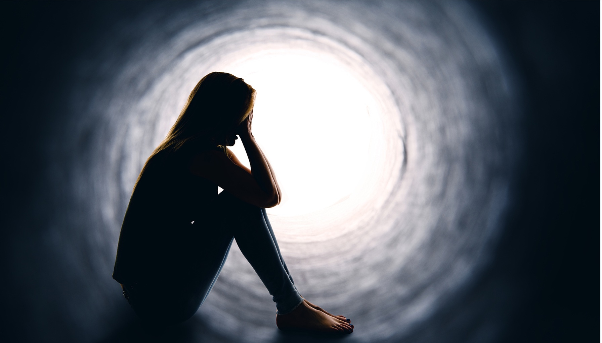
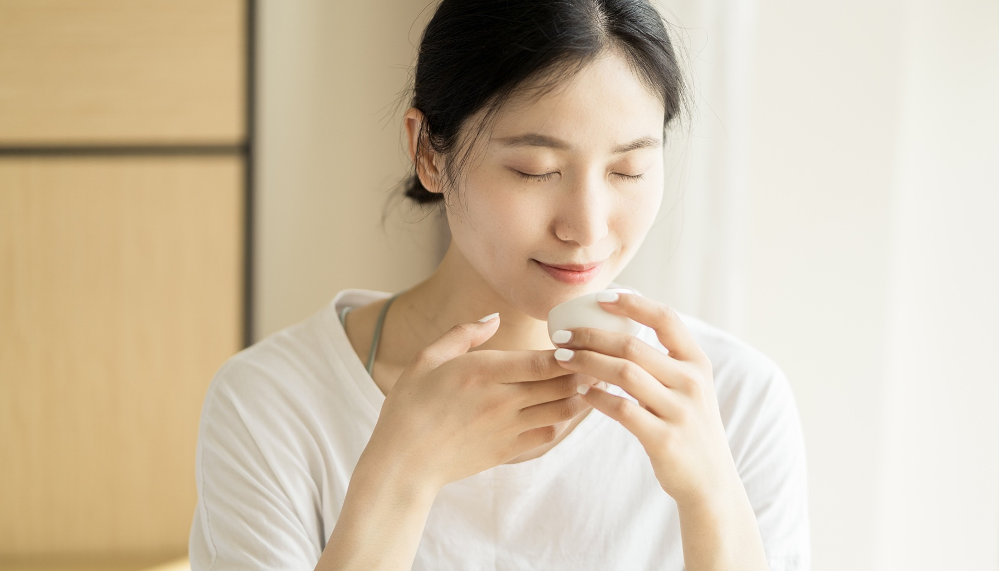
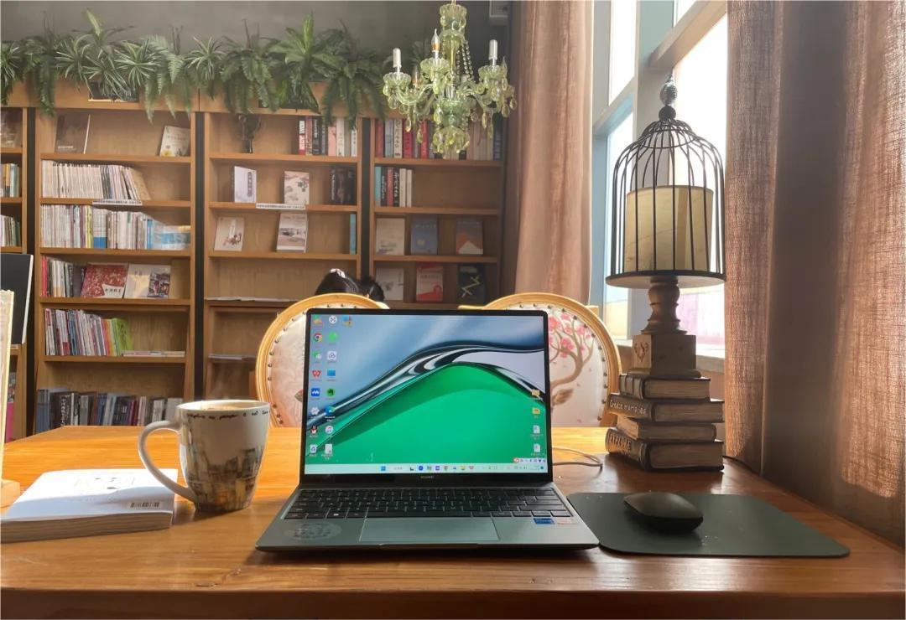

### 深度调整自己，重新再出发

春节前到现在，差不多快三个月的时间没有给自己安排任何工作。完全的停下来了，深度的陪伴自己，调整自己。

从阳了之后，身体就走不动了，最开始很焦虑，希望自己快点好起来，结果没有很快好起来，眼睛还时不时的不舒服，身体似乎也变得非常的懒，不想动，突然对很多事情没有了兴趣。

不断的在想，到底是为什么呢？看着身边的人不断的报喜，今天又进账了多少，今天又收获了什么…大家都在稳步前进，只有我走不动了，而且连走的欲望都没有。

头脑里是满满都攻击和评判自己的声音。每天看着自己无处安放的焦虑和不安，最开始很排斥，希望自己快点度过这个阶段，然而并没有。

慢慢的尝试着去接纳不安，接纳焦虑。放下想要改变的想法。假如焦虑和不安就是我以后人生的日常又会怎样？松下了那一刻，竟然没有那么排斥这种感觉了，慢慢的，开始允许它们存在。慢慢的，竟然接纳了这份感觉，和它们在一起。

整个人瞬间轻松了，突然知道了我一直走走停停，起起伏伏的原因。是因为我一直在追求一种好的状态，一种想通过各种努力去除这个不好的状态。

### 学会接纳自己，收获和谐自我关系

开始停下来的这段时间，学会了和焦虑、不安相处。接纳它们就是我的一部分。不再想着赶走它们的时候，我竟然也感受不到强烈的不安了。

疗愈，就在接纳的那一刻发生了。

我开始学会了慢慢地去说一句话，慢慢地学做一道菜，慢慢地吃顿饭，看一本书，喝一杯茶，陪伴家人…

 

不再总是以前那样的着急，开始慢慢的走路，看身边的风景。

我学会开始关注自己的身体，与身体连接。头脑里的杂念慢慢的变少了，攻击声也变少了。允许自己深度休息的这段时间，收获了更好的自我关系。

### 学会享受当下，和焦虑和平共处

再看见身边努力的人们不断的有收获，我不再焦虑，不再着急，在心里默默祝福他们。我知道如果我真的想我也可以，我知道每个人的花期不一样。

努力修炼好自己的底盘，为重新出发蓄力。允许自己可以什么都不做时间里，身体不再那么疲惫，懒洋洋了，开始感觉到内在有力量在滋生。

身体也开始慢慢的有些活力，愿意去做一些之前不愿意做的事情。做做家务，收拾房间…这些都变得没有那么麻烦了。

我学会了和头脑里的杂念和平相处，和焦虑、不安和平相处。

开始真正享受当下，活在当下。

这段时间躺平后的心灵变化和收获。自我关系是一切关系都核心，只有深度接纳自己的人，自我关系才会好，自我关系好了，和周围的关系自然不会有问题。

所以，累的时候，记得停下来先关注自己。
