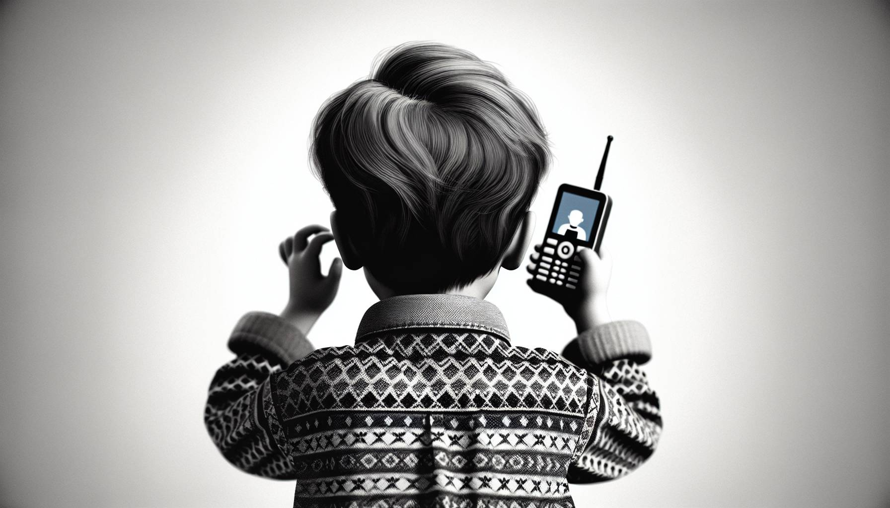
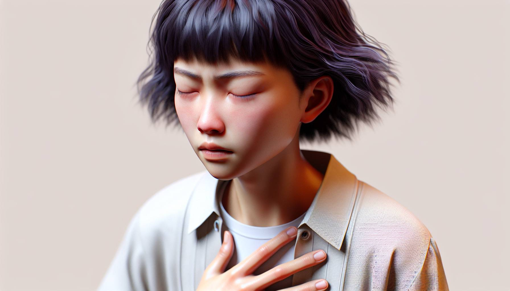

### 孩时记忆

我从小就一直很懂事很乖巧，是同学和街坊领居大家口中常说的 “别人家的孩子” 。然而长大结婚后我越来越发现我却有很多的愤怒。

最开始的冲突是跟爸爸和婆婆，后来发现对先生和妈妈也同样有愤怒，再后来我发现对身边的其他人的行为也让我时常感觉到愤怒。

原来的我一直选择压抑、再压抑，但蓄积到一定量的时候就彻底崩盘爆发了。这些年我一直在寻寻觅觅，拜师深度学习和实践体验各种各样处理情绪的方法，直到我能和情绪很好的相处。

### 情绪怒起

但是今天一件事情让我再一次感受到愤怒，我能感觉胸口强烈的能量翻腾，翻云覆雨般的起起伏伏。

 

我静静的坐着，观察着，慢慢的，愤怒开始变得难过，眼泪夺眶而出。我拿起电话直接发了个语音给一位朋友，把曾经想表达而没有表达的话和感受说了出来。这次我没有害怕，我直接表达了我的愤怒和难过。

当我们语音结束后，我突然体会到这个愤怒的意义了。我再一次感受到全身能量的流动，身体慢慢的变得畅通和舒展了。

原来很多情绪都被我们摁住了，遗忘了，或者合理化了，但身体却依然还记得。

随后我继续观察着我的愤怒，不带评判的看着它，和它待在一起，不期待它快点离开。只是静静的感受和观察这股能量的涌动。

### 自我觉察

我好奇这个愤怒还想告诉我什么？

突然间一股感恩的能量在全身涌动着，原来愤怒只是教会我要勇敢的做自己，保护自己，争取自己的权益......感觉身体里一股阳性能量在流动，内在的力量在升起。

眼泪再次夺眶而出，这是来自我爸爸的能量，我爷爷的能量，我祖祖辈辈的能量。原来我的潜意识是在用尽全力压抑这份能量，不接纳这份能量。

从小看着爷爷和爸爸他们发脾气，愤怒，看他们和别人吵架，甚至大打出手.....我很担心、也很害怕。于是在心里就塑造了一个信念：长大了我一定不要成为他们这样，用这样的方式解决问题，他们是不对的，不好的。

于是我确实成为和他们看似相反的样子，同时我也深深的压抑着我这部分能量。

放下愤怒后，我突然明白这个愤怒的意义，接纳了爸爸的愤怒，还有祖祖辈辈的愤怒，这份强而有力的阳性能量。原来我一直都有，我却一直用力的封印着。

这一刻对爸爸和爷爷，还有婆婆有了更多的接纳。在那个年代他们用愤怒保护了自己，保护家人，没有什么不对的。而我对这些事情的解读让我完全失去了这份阳性能量。 

### 接纳觉醒

今天我体悟到这份愤怒的意义，也体会到因为这份接纳、承接、臣服，接收到来自父母祖先的力量和能量，还有生命神奇的变化和进阶。也对情绪有了更深一层的领悟。

原来我们不是要去想办法解决这些情绪，排空所有的负面情绪，而是允许它的存在，让它从我这里流过。

当我们完全的接纳任何一种能量，不带任何评判的接纳，全身心每个细胞都是放松的自然的接纳，各种能量的流通。

当我完全没有评判的时候，我就能用好每一种情绪的好的一面。 

情绪有好也有坏，每一份负面情绪都有一份正面意义。当我们接纳它时，就能用出这种情绪带给我们好的一面。

拥抱它时，就整合和完整了我们生命的每一个面向，拿回属于我们的力量。
