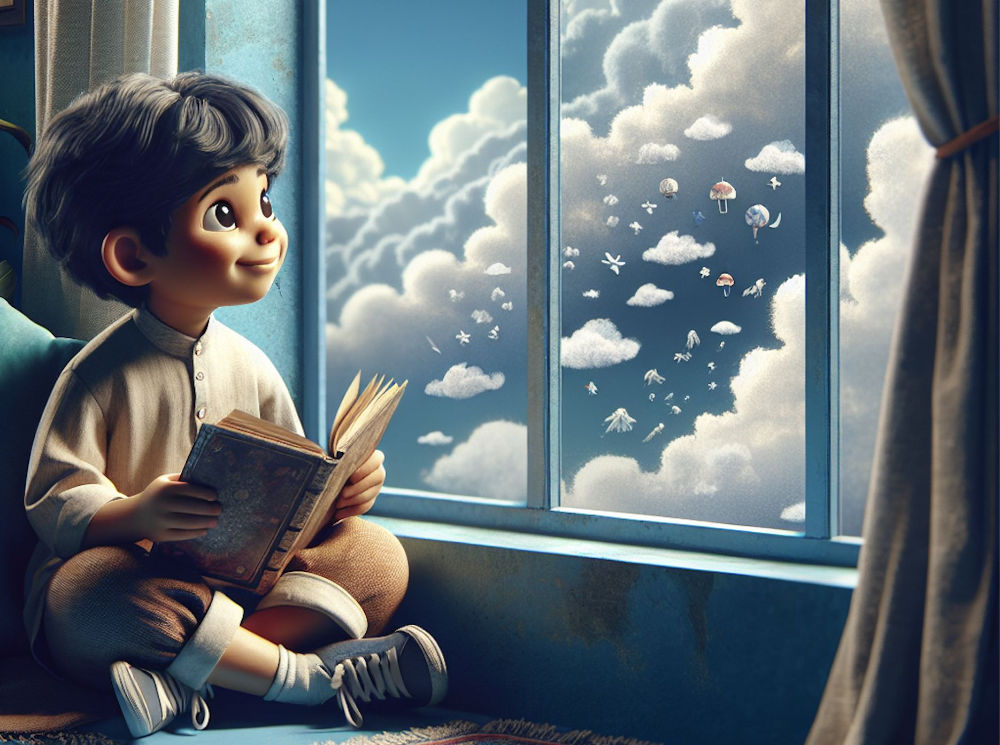

### 从懵懂到迷茫

从小我就是负面情绪很多的人。妈妈常常跟我说：小孩子不要总是叹气，然而那时候我也不知道为什么我总是莫名其妙的很悲观，不容易开心。

大家说我多愁善感，同学们叫我：林妹妹，内心脆弱，情感丰富，喜欢写小作文。

大家说，我长大了适合做一个悲情作家。在高中时作文竞赛我获奖了，看着我的照片挂在了学校宣传栏。那时候我想，当个作家是挺好的，多自由啊。或者当个老师，校园生活简单纯粹。

 

我也以为我会保持这个爱好，选择文科，选择中文系，实现当一个悲情作家或者老师的梦想。文理分科时，我看到我玩的好的同学们都选择理科，选择文科的则会被分到别的班级里去，由于对班主任和同学们已经很熟悉了，我不想去陌生的班级，于是我也随大流选择了理科。

高中毕业填报志愿时，我不知道选什么专业，因为毕竟从小除了喜欢看书，写日记和写小作文之外没有培养过任何其他的兴趣爱好，也不知道那些专业都是干嘛的。我没有选择教师的师范专业，因为有人说老师工资不高，而当时我的家庭则需要一份相对来说赚钱多一点的工作来减轻家里的负担。

最后是因为我的好友选择了建筑设计，我也就选择这个专业。从毕业到`2020`年，我一直在这个专业上奋斗和挣扎，曾经有两次我都主动放弃了，但有因为各种原因又继续回到设计的行业里。

### 想改变却屡屡受挫

终于，我想考注册建筑师，当一个优秀专业的建筑设计师。我想用这个结果刷新我的履历。报了很多课，每天早早起来，趁着孩子没醒学习做题，时常凌晨`3点`多起来看书画图，在地铁上听课，一边工作一边备考。功夫不负有心人，在那年底我如愿拿到了二级注册建筑师证书。

然而我的职业生涯再一次中断了，这一次是被动的。因为政策的改革，我没有资格参加一级注册建筑师考试。这意味着我在`30`多岁时已经看见了我的职业天花板。

我记得那时候很多和我一样情况人组织各种团体想要申请政策的宽容，然而被刷出去的人就是刷出去了。

我很不甘，也很懊悔为什么不在大学时就提升学历。现在`30`多岁带着还很小的孩子，一切都变得没那么容易。 

在不甘、懊悔、纠结、迷茫中过了一段时间。我每天都在想我应该如何走接下来的路？在一个夜不能寐的夜晚，我听见来自内心的声音：停下来。

接下来，房地产大环境开始走下坡路，全行业持续低迷，而我，被公司辞退了。就在我从老家赶回公司忙完一个项目后，毫无征兆的被裁员了。

离开公司的那一刻我竟然有那一丝丝的轻松和雀跃。虽然我也不知道接下来我可以做什么，因为毕竟我除了设计，我没有任何其他技能。

停下来的时间，先生说：没关系，大不了再找一份工作。然后我却迟迟没有动静，我发现我不想找工作，我好像觉得哪里不对劲，我想对我的人生多来一次复盘和回顾。

停下来的时间，我除了看书，就是逛各种咖啡店和书店，我也非常的焦虑和迷茫。我不知道我的未来在哪里？我唯一确定的是，现在的不是适合我的路，既然老天给我关上了这扇门，我知道我一定会给我打开一扇窗，我只需寻着指引找到它。

在焦虑和迷茫中，我只能报考各种课程来让自己感觉到我在进步。那年的十一假期，我选择独自去了一个陌生的城市，因为一个陌生的老师，上一个对我来说相当陌生的课。

也就是这样，我放下建筑设计师的职业身份，走上了身心灵疗愈之路。为了搞好自己，搞明白自己的人生，探索生命的意义，我在不断的学习。

学习了多年后我又开始焦虑，因为没有了工资收入，投入的越多（超过百万）就越迷茫。再后来我遇到了生命中的贵人——心理学创富创始人荣姐，我跟随她学习心理学和商业营销；内修思维，外修营销，开始了知识变现，把所学的，所经历的，所实践的，一点点的用出来。

然而在用的过程中，还是会焦虑，因为不清晰自己的定位，不明确自己的核心优势。于是我又停下来了，再一次整合和梳理自己。 

### 从确定到确信

在停下的时间里，我发现我从小到大一直困扰我的是我的情绪。我学习的初衷就是为了让自己情绪稳定。于是研究各种各样与情绪相关的方法，日日夜夜的实践。最终我从情绪里解脱出来了，我找到了和情绪相处的最佳方式，也找到了放下情绪极简的路径和方法。我开始在自己的孩子和家人身上去实践。现在孩子成了一个几乎没有负面情绪的开心宝宝；同时我与父母的关系开始破冰，并很快得到改善，现在我们已经成为了每隔一两天就会侃侃而谈的朋友，这一切太神奇了。

于是，我开始在来访者身上去实践，我发现也是立竿见影的效果。她们恐惧几十年的事情尽然在一个小时的个案咨询中，完全换了一个人，她们变得有力量有智慧地去行动了。

我很惊喜，我也确信，我的这个伤痛变成了我的天赋。

我也很自信和有底气的知道，我可以帮助到很多和我曾经一样自卑，没有主见，人云亦云，悲观，负面情绪很多的女性。帮助她们情绪自由，家庭幸福，财富丰盛。

经历过黑暗，也想为你照亮。

如果你和我曾经一样迷茫痛苦，欢迎你与我交流，我会分享我的经验帮助你走出低谷。
