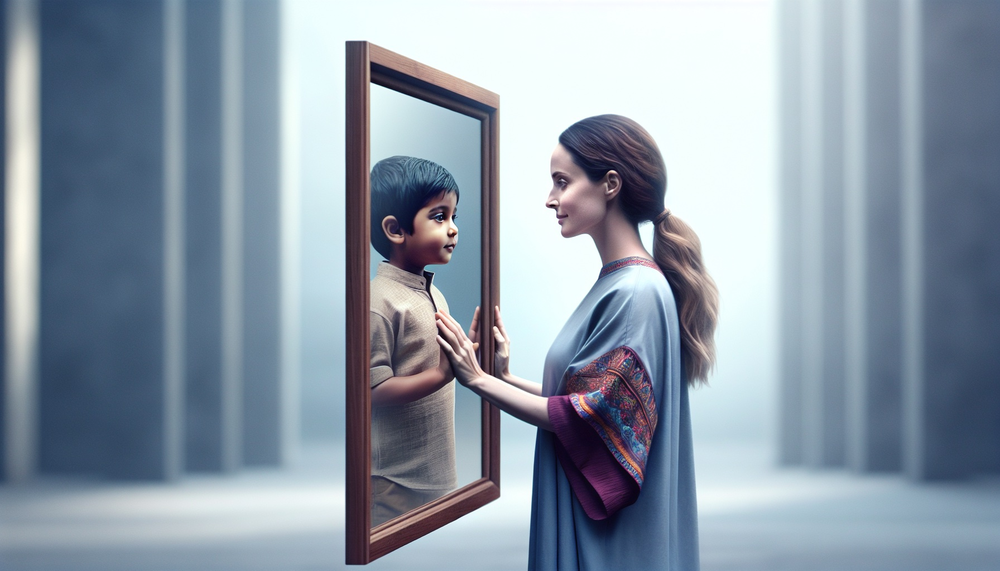

### 孩子是镜子也是老师 

前几天在一个妈妈群，看到很多妈妈都在讨论养孩子不容易，现在孩子学业压力大，父母工作忙，孩子情绪不好，甚至开始厌学，亲子关系鸡飞狗跳。大人小孩都很累，彼此对抗和消耗。

我也是一个六岁男孩的妈妈，深有感触。曾经我也在育儿这件事上很焦虑。担心孩子的身体、营养、习惯、学习、情绪等各种问题。怎么努力他都不能如我期待的那样改变或成长，甚至不断的制造问题，焦虑又生气。

因此走上了心理学、身心灵学习之路。后来才发现，很多时候孩子的问题是因为父母的行为和情绪模式导致的。

没有有问题的孩子，只有不成长的父母。

问题不是问题，是我们回应问题的方式创造了问题。

当我们遇到孩子一点小问题，我们情绪引发的惯性行为反而让孩子的小问题变成了大问题。直到我慢慢的疗愈自己，爱自己，修正自己，拥有稳定的情绪时，我发现孩子很多的问题都不是问题，很多问题都迎刃而解。

父母的一言一行都影响着孩子。孩子是我们的复印件，他们不可能成为我们期待的样子，只会成为我们的样子。

孩子也是我们的镜子，照见了我们自身的问题，当我们修正了，才有可能养育出积极乐观又智慧的孩子。 

### 孩子需要缓慢温柔的陪伴

之前朋友因为亲子关系的问题来找我做了一个咨询。她说，这半年来一直因为孩子不上学的事情焦头烂额。尝试了各种办法，做了各种各样的努力，折腾了一个学期，孩子现在还是不肯去学校。 

她每天想着法子鼓励和引导，可是到了学校门口，孩子还是不肯去，有时候又哭又闹，有时候需要妈妈陪着去学校，有时候说舍不得妈妈……这件事让她的耐心不断的消耗，感觉无力又沮丧。  

咨询的过程中，帮助她看见了自己对于孩子的控制让孩子面对新的环境更加的不适应和恐惧，看见原来孩子的问题其实是我们自己的问题。是我们与自己的关系出了问题，才会把期待投射到孩子身上，期待不能被满足时，又被各种负面情绪影响，孩子也感觉越来越焦虑、恐惧。

帮助她疗愈了自己，处理了她关于孩子上学这件事的负面情绪和信念，同时教会她一些自我疗愈和释放情绪的方法回去练习和实践。她说：原来我费尽心力的，想各种各样的方法去改变这件事，控制孩子，是因为我不能接纳我是一个失败的妈妈。

结束后，她释然了。说回去后把托管班停了，下午把孩子接回去，和爸爸多陪陪孩子，把以前缺的家庭生活补上，陪孩子多玩玩，为他创造更多的快乐。

当我们把对他们的担忧和恐惧转化成爱，顺势而为，用缓慢的、温柔的、允许的方式接纳他们的问题时，往往我们更容易收获惊喜。

一段时间后，朋友再来见我。我看到她明显比上一次更开心了。我问了问孩子的情况，她说回去后反思了自己这些年的一些行为带给孩子很多的压力，自从自己情绪变得更稳定后，心情也更好，更有能量陪伴孩子。

家庭互动和生活时间也更多更丰富了，允许他可以慢一点，给他时间，现在孩子已经愿意去学校了。

### 妈妈情绪稳定，是孩子成长最好的礼物 

我由衷的感到开心。妈妈的情绪稳定，对孩子的成长是至关重要的，是孩子成长的最好的礼物和支持。当我们自己情绪稳定，有处理情绪的能力时，就能把真正的爱和智慧带给孩子，孩子也会更乐观积极。

一个焦虑、恐惧的妈妈，没办法给孩子心灵营养， 当我们成为一个心境平和的人时，我们再看孩子，才会看到他更多的优点。以稳定、坚决、温和、有力的方式坚持去爱孩子，爱他如是，而非我所愿，才会让一个孩子真正成为他自己。 

妈妈成长一小步，孩子进步一大步。育儿等于育已，陪同孩子成长的路上，我们一起成长一起做情绪稳定的父母，做孩子身后最坚定的后盾和强大的支援，在他们遇到挑战时能为他们注入心理营养，是孩子一生的财富。 

孩子的教育，是慢的艺术。当你不用力，不控制，不苛责，允许他偶尔有停滞，允许他慢慢来，改变自然而然就发生。
